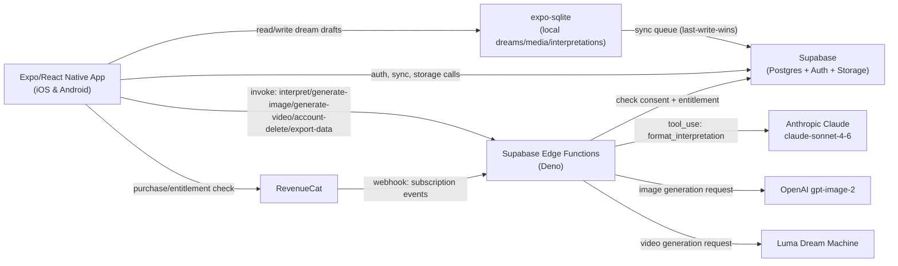
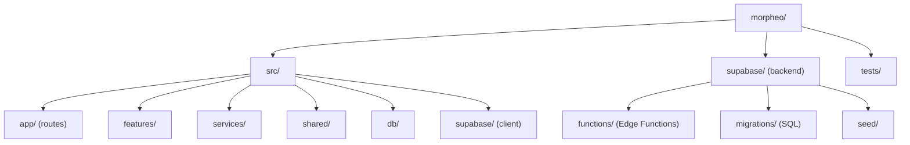

# Morpheo — Project Overview

## 1. What this project does

Morpheo is a mobile app (iOS/Android, one codebase) where a user logs their dreams by text or voice and gets an AI-generated interpretation, plus optional AI-generated images/video of the dream, with a paid tier unlocking more monthly interpretations and analytics on recurring dream symbols.

## 2. Tech stack

| Layer | Technology + version | What it's actually used for here |
|---|---|---|
| Language | TypeScript ~5.8 (strict mode) | All app code; `tsconfig.json` has `strict: true`, `noUncheckedIndexedAccess: true` |
| Mobile runtime | React Native 0.79.6 + React 19 + Expo SDK 53 (managed) | The app itself, built via `expo run:ios` / `expo run:android` |
| Routing | Expo Router ~5.1 | File-based navigation under `src/app`, `(auth)` and `(main)` route groups |
| Backend | Supabase (PostgreSQL, Auth, Storage, Edge Functions, Realtime) | `@supabase/supabase-js`; Edge Functions in `supabase/functions/*` (Deno) |
| Local DB | expo-sqlite ~15 + drizzle-orm ^0.45 | Offline-first store, schema in `src/db/schema.ts` (`dreams`, `interpretations`, `media`, `recurrence_patterns`) |
| State/data sync | Custom sync queue (`syncStatus` field + `useSyncOnConnect`) | Last-write-wins sync between SQLite and Supabase |
| AI — text | Anthropic Claude (`claude-sonnet-4-6`) via `@anthropic-ai/sdk` in Deno Edge Function | `supabase/functions/interpret/index.ts` — structured output via a `format_interpretation` tool call |
| AI — image | OpenAI gpt-image-2 | `supabase/functions/generate-image`, client-side `OpenAIImageGenerationService` |
| AI — video | Luma Dream Machine | `supabase/functions/generate-video`, client-side `LumaVideoGenerationService` |
| Payments | RevenueCat (`react-native-purchases`) | `RevenueCatEntitlementService`, webhook handler in `supabase/functions/webhooks` |
| Auth | Supabase Auth + `expo-apple-authentication` + `@react-native-google-signin/google-signin` | Sign-in/sign-up screens, `SupabaseAuthService` |
| Local security | `expo-local-authentication` + `expo-secure-store` | Face ID/biometric app lock (`ExpoLocalLockService`, `lock.tsx`) |
| Voice input | `@react-native-voice/voice` | Speech-to-text dream dictation (NOT `expo-speech`, which is TTS-only) |
| State (global, planned) | Zustand ^5 | Listed as a dependency; not yet clearly wired into a store in the sampled files |
| Test framework | Jest 29 + `jest-expo` + `@testing-library/react-native` | `npm test` / `npm run test:ci`; 31 test files under `tests/unit`, `tests/integration`, `tests/e2e` |
| Lint/format | ESLint 8 + Prettier 3 + Husky/lint-staged | Enforced pre-commit and in CI |
| CI | GitHub Actions (`.github/workflows/ci.yml`) | Two jobs: lint+typecheck+format, and unit tests with coverage artifact upload |
| Deployment target | EAS (`eas.json` present) + Supabase project (migrations, seed, functions) | Mobile builds via EAS; backend via `supabase db push` / `supabase functions serve` |

## 3. Folder structure

```
morpheo/
├── src/                     # App source (TypeScript, verified by opening files)
│   ├── app/                 # Expo Router screens — file = route
│   │   ├── (auth)/          # onboarding (welcome/consent/lock-setup), sign-in, sign-up, lock, forgot-pin
│   │   └── (main)/          # journal, log, insights, settings, paywall — the signed-in app
│   ├── features/            # Feature modules: auth, dream-log, interpretation, journal,
│   │                        # media-generation, recurrence, settings, subscription
│   │                        # (hooks + repositories + views, e.g. useJournalSearch.ts, dreamRepository.ts)
│   ├── services/            # Adapter interfaces + concrete impls (ai/interpretation, ai/image,
│   │                        # ai/video, auth, storage, entitlement, notifications) behind ServiceRegistry
│   ├── shared/               # Design tokens (colors.ts, spacing.ts) + shared components (LoadingState, etc.)
│   ├── db/                  # Drizzle ORM SQLite schema (schema.ts) + client
│   └── supabase/            # Supabase JS client instance
├── supabase/
│   ├── functions/           # Deno Edge Functions: interpret, generate-image, generate-video,
│   │                        # account-delete, export-data, webhooks
│   ├── migrations/          # 10 numbered SQL migrations (auth ext → content → ai → analytics →
│   │                        # RLS → triggers → pg_cron → grants)
│   └── seed/                # system_prompts.sql — versioned AI system prompts, server-side only
├── tests/
│   ├── unit/                # db, features, services, shared — 31 test files total across all dirs
│   ├── integration/         # auth, dream-log, edge-functions, interpretation, media, onboarding,
│   │                        # settings, subscription
│   └── e2e/flows/           # Detox/Maestro-style end-to-end flow specs
├── specs/001-morpheo-app/   # Spec-kit: spec, plan, tasks for this feature
├── .specify/                # Spec-kit governance (constitution.md)
└── .github/workflows/       # ci.yml
```

## 4. How to run it

```bash
# Setup
npm install
cp .env.example .env.local      # fill EXPO_PUBLIC_SUPABASE_URL, EXPO_PUBLIC_SUPABASE_ANON_KEY,
                                  # EXPO_PUBLIC_REVENUECAT_API_KEY
supabase secrets set ANTHROPIC_API_KEY=... OPENAI_API_KEY=... LUMA_API_KEY=... \
  REVENUECAT_WEBHOOK_AUTH_HEADER=...   # Edge Function secrets, never in .env.local

# Local backend (optional, for full-stack dev)
supabase start
supabase db push        # apply migrations
supabase db seed         # seed system_prompts
supabase functions serve # serve Edge Functions locally

# App
npx expo start           # dev server
npx expo run:ios         # or: npm run ios
npx expo run:android     # or: npm run android

# Quality gates (all run in CI)
npm run lint
npm run format:check
npm run typecheck
npm test                 # or: npm run test:ci (with coverage)
```

## 5. Main features

Inferred from `src/app` route files and feature modules:

- Onboarding flow: welcome → consent (AI data use) → lock (biometric/PIN) setup
- Email/password and social (Apple, Google) sign-in/sign-up
- App lock screen with idle-timeout re-lock (`useIdleTimeout`, biometric or PIN unlock, forgot-PIN recovery)
- Dream journal: list/search/filter past dream entries (`useJournalFilters`, `useJournalSearch`)
- Dream logging by text or voice dictation
- AI dream interpretation (symbolic / mythological / psychological style) with keywords, emotions, and cultural references, gated by monthly entitlement limit and user consent
- AI-generated dream image (gpt-image-2) and optional video (Luma) per dream entry, with a capped regeneration count
- Recurrence insights: top recurring keywords/emotions/symbols over time, with a premium-only deeper analytics view
- Subscription/paywall via RevenueCat, with a usage indicator for free-tier limits
- Settings: cache size display/management, data export, privacy info, notification preferences, interpretation style, account deletion (exact-phrase confirmation)

## 6. Interesting numbers

- Source + backend code: ~6,175 lines across 97 files (85 `.ts`/`.tsx` in `src/`, 12 `.sql` in `supabase/`)
- Test code: ~2,548 lines across 31 test files (unit + integration + e2e)
- Total repo TS/TSX/SQL: ~9,141 lines
- 8 service adapter interfaces in `src/services/` (one per external integration)
- 8 feature modules under `src/features/`
- 26 route files under `src/app`
- 6 Supabase Edge Functions; 10 SQL migrations; 1 seed file
- Direct dependencies: 36 runtime + 19 dev
- Contributors: 1 (Julien de Fondaumiere)
- Commits: 4 (repo initialized then iterated — "Initialization", "base app ready", "fix dream interpretation", "fix the tests")
- Last commit: 2026-08-21

## 7. Diagrams

### Architecture



### Folder structure



---

## ASSUMPTIONS

- Zustand is a listed dependency but no store usage was found in the files sampled (app state currently observed uses `useState`/`useEffect` in `_layout.tsx` and screens) — worth a follow-up grep before relying on this for future state work.
- "Deployment target" for the mobile app is inferred from the presence of `eas.json`; no EAS build/submit commands were run or verified.
- Feature list in section 5 is inferred from route file names and imported feature hooks/components, not from running the app.
